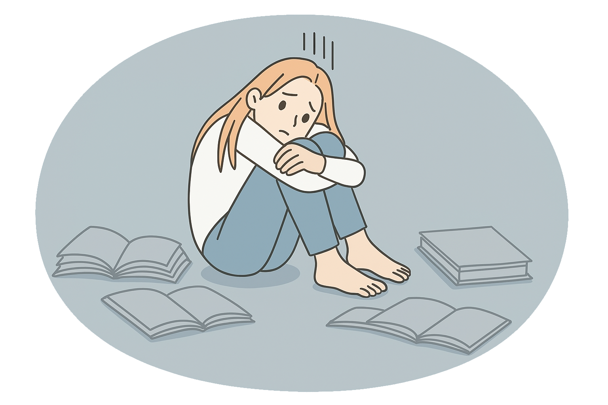

<!-- Custom Title Slide -->

::: {style="text-align: center; padding-top: 100px;"}
<h1>Exploring Potential Influencers of Math Student Performance</h1>

<p>Lauren Duvall, Shikyna William, Thomas Linden</p>

<p><em>`r Sys.Date()`</em></p>

<br><br> 
:::

------------------------------------------------------------------------

```{r setup, include=FALSE}
knitr::opts_chunk$set(echo = TRUE, warning = FALSE)
suppressMessages(library(dplyr))
suppressMessages(library(ggplot2))
suppressMessages(library(plotly))
suppressMessages(library(readr))
suppressMessages(library(knitr))
suppressMessages(library(GGally))
suppressMessages(library(kableExtra))
```

## Introduction

-   Dataset: [UCI Machine Learning Repository](https://www.kaggle.com/datasets/adilshamim8/math-students/data)
-   Topic: Student performance in math programs
-   Collection:
    -   Two Portuguese secondary schools
    -   School reports and questionaires
-   Features: Academic, personal, and social aspects of a student's life

<br>

### Why Is This Interesting?

-   Clean, Structured and Small
-   Focused on Math Performance: More opportunity for in-depth insights
-   Rich Demographic Features: Gender, parental education, lunch type, etc
-   Equity and Policy: Can explore impact of social and economic factors
-   Portugal Differences
    -   Highschool is 3 years; 15-18 years old
    -   Each year subdivided into thirds
    -   Drinking age - 18
    -   Age of consent (relationship status) - 14

------------------------------------------------------------------------

## Objective

-   Identify significant influencers of math performance
-   Test the data to see if reality rejects our hypotheses

<br>

### Categories Analyzed

-   Logistics & School Choice
-   School & Demographics
-   Family Background
-   Academic Support & Study Habits
-   Activities & Social Life
-   Health & Lifestyle
-   Academic Performance

------------------------------------------------------------------------

## Load Packages

```{r libraries, echo=FALSE, results = 'hide'}
library(dplyr)
library(tibble)
library(tidyr)
library(plotly)
library(DT)
library(GGally)
library(ggridges)
library(kableExtra)
library(patchwork)
library(ggforce)
```

<br>

-   **dplyr** for basic data manipulation.
-   **DT / kableExtra** to display the data tables.
-   **tidyr** for table pivots.
-   **ggplot2** for creating plots.
-   **plotly** to add interactivity to the plots.
-   **GGally** for ggparacord()'s parallel coordinates chart.
-   **ggridges** for ridge plot.
-   **patchwork** for side by side plots.
-   **ggforce** for plot annotations.

------------------------------------------------------------------------

## Data Cleaning

```{r formatting, echo=FALSE, results='hide'}
raw <- read.csv("Math-Students.csv")
# Rename cols, convert to factors, add any necessary levels, transmute to drop old columns
formatted <- raw %>% transmute(
  school = as.factor(school),
  sex = as.factor(sex),
  age = age,
  address = as.factor(address),
  fam_size = as.factor(famsize),
  parental_stat = as.factor(Pstatus),
  mom_edu = factor(Medu, levels = 0:4, ordered = TRUE),
  dad_edu = factor(Fedu, levels = 0:4, ordered = TRUE),
  mom_job = as.factor(Mjob),
  dad_job = as.factor(Fjob),
  attend_reason = as.factor(reason),
  guardian = as.factor(guardian),
  travel_time = traveltime,
  study_time = studytime,
  failures = failures,
  school_support = as.factor(schoolsup),
  family_support = as.factor(famsup),
  extra_paid_classes = as.factor(paid),
  activities = as.factor(activities),
  nursery_school = as.factor(nursery),
  pursue_higher_edu = as.factor(higher),
  internet_use = as.factor(internet),
  romantic = as.factor(romantic),
  family_relationship = factor(famrel, levels = 1:5, ordered = TRUE),
  free_time = factor(freetime, levels = 1:5, ordered = TRUE),
  go_out_w_friends = factor(goout, levels = 1:5, ordered = TRUE),
  workday_alcohol = factor(Dalc, levels = 1:5, ordered = TRUE),
  weekend_alcohol = factor(Walc, levels = 1:5, ordered = TRUE),
  health = factor(health, levels = 1:5, ordered = TRUE),
  absences = absences,
  period1_grade = G1,
  period2_grade = G2,
  final_grade = G3
)
sum(is.na(formatted))
```

-   transmute(): Factors and levels.
-   Missing values?

```{r datatable, echo=FALSE}
datatable(formatted,
  rownames = FALSE,
  options = list(
    pageLength = 10,
    scrollX = TRUE,
    autoWidth = TRUE,
    columnDefs = list(list(className = "dt-center", targets = "_all"))
  )
)
```

------------------------------------------------------------------------

## Key Terms

<br>

-   **School**: Either Gabriel Pereira or Mousinho da Silveira
-   **Address**: Urban or Rural
-   **Attendance Reason**: Close to 'home', school 'reputation', 'course' preference or 'other'
-   **Extra Paid Classes**: Extra paid classes within the course subject (Math or Portuguese). Yes or No.
-   **Nursery School**: Portugal's version of Pre-School. Attended? Yes or No.
-   **Family Support**: Family educational suppor. Yes or No.
-   **Family Relationship**: Quality of family relationships. Scale from 1-5, very bad to excellent.
-   **Workday Alcohol**: How much drinking during the week. Scale from 1-5, low to high level of drinking.
-   **Weekend Alcohol**: How much drinking during the weekend. Scale from 1-5, low to high level of drinking.
-   **Health**: Current health status. Scale from 1-5, very bad to very good.

------------------------------------------------------------------------

## Exploratory Data Analysis

```{r correlation, echo=FALSE, fig.align='center'}
# Make correlation table
cor_df <- formatted %>%
  select(where(is.numeric)) %>%
  cor(use = "complete.obs") %>%
  as.table() %>%
  as.data.frame()

colnames(cor_df) <- c("Var1", "Var2", "Correlation")

cor_df %>% ggplot(aes(Var1, Var2, fill = Correlation)) +
  geom_tile(color = "white") +
  scale_fill_gradient2(
    low = "#95aab7", mid = "white", high = "#eac39c",
    midpoint = 0, limit = c(-1, 1), name = "Correlation"
  ) +
  labs(title = "Correlation Heatmap", x = "", y = "") +
  theme_minimal() +
  coord_fixed() +
  theme_minimal() +
  theme(axis.text.x = element_text(angle = 45, vjust = 1, hjust = 1))
```

Missing variables: Factors

-   Grades from all three periods are strongly positively correlated.
-   Grades are negatively correlated with the number of failures.
-   Travel time is inversely proportional to study time.
-   Number of failures is positively correlated to travel time; negatively correlated with study time.

------------------------------------------------------------------------

## School & Demographics

<br>

-   Do students from different schools show significant differences in final performance? INSIGNIFICANT
-   Is there an interaction between romantic relationships and gender on final grade?

------------------------------------------------------------------------

### Do students from different schools show significant differences in final grade?

```{r compare_schools, echo=FALSE, fig.align='center'}
# Prepare the data
plot_data <- formatted %>%
  select(school, final_grade) %>%   # Select relevant columns (school and final grade G3)
  group_by(school) %>%     # Group by school (GP vs MS)
  summarise(
    mean_period3 = mean(final_grade, na.rm = TRUE),
    median_period3 = median(final_grade, na.rm = TRUE),
    sd_period3 = sd(final_grade, na.rm = TRUE),
    count = n()
  )

# View summary statistics
#plot_data

#plot
formatted %>%
  ggplot(aes(x = school, y = final_grade, fill = school)) +
  geom_violin(trim = FALSE, alpha = 0.8, color = NA) +
  geom_boxplot(width = 0.1, fill = "white", outlier.color = "white", outlier.shape = 16) +
  scale_fill_manual(values = c("GP" = "red", "MS" = "blue")) +
  labs(
    title = "Final Grade Distribution by School",
    x = "School",
    y = "Final Grade"
  ) +
  theme_minimal(base_size = 14) +
  theme(
    plot.title = element_text(face = "bold"),
    plot.subtitle = element_text(size = 11),
    axis.text = element_text(color = "gray20"),
    panel.grid.major.y = element_line(color = "gray85"),
    legend.position = "top"
  ) +
  scale_x_discrete(labels = c(
    "GP" = "Gabriel Pereira",
    "MS" = "Mousinho da Silveria"
  ))
```

<br>

The selection of school has no evidence of affecting student performance.

------------------------------------------------------------------------

### Is there an interaction between romantic relationships and gender on the final grade?

```{r romance_gender, echo=FALSE, fig.align='center'}
formatted %>%
  ggplot(aes(x = romantic, y = final_grade, fill = sex)) +
  geom_boxplot(position = position_dodge(0.8), width = 0.6, outlier.shape = 16, alpha = 0.7) +
  scale_fill_manual(values = c("F" = "#FF69B4", "M" = "#1E90FF")) +
  labs(
    title = "Final Grade by Relatonship Status split by Gender",
    x = "Relationship Status",
    y = "Final Grade",
    fill = "Gender"
  ) +
  stat_summary(fun = mean, geom = "point", shape = 23, size = 3, fill = "white", color = "black", position = position_dodge(0.8)) +
  theme_minimal(base_size = 14) +
  theme(
    plot.title = element_text(face = "bold"),
    plot.subtitle = element_text(size = 11),
    axis.text = element_text(color = "gray20"),
    panel.grid.major.y = element_line(color = "gray85"),
    legend.position = "top"
  ) +
  scale_x_discrete(labels = c(
    "no" = "Single",
    "yes" = "Dating"
  ))
```

<br>

There is correlation between relationship status and final grades when comparing by gender.

Dating Females have a lower median, minimum, and IQR.

Dating Males are affected in the opposite manner.

------------------------------------------------------------------------

## Family Background

<br>

-   Does having family educational support at home help students perform better in school?

------------------------------------------------------------------------

### Does having family educational support at home help students perform better in school?

```{r family_support_better_school, echo=FALSE, fig.align='center'}
formatted %>%
  ggplot(aes(x = as.factor(final_grade), fill = family_support)) +
  geom_bar(position = position_dodge(width = 0.7), width = 0.6, alpha = 0.9) +
  scale_fill_manual(values = c("yes" = "red", "no" = "blue")) +
  labs(
    title = "Impact of Family Support on Student Performance",
    subtitle = "Distribution of Final Math Grades Based on Family Support",
    x = "Final Grade",
    y = "Number of Students",
    fill = "Family Support at Home"
  ) +
  theme_minimal(base_size = 14) +
  theme(
    plot.title = element_text(face = "bold"),
    plot.subtitle = element_text(size = 11),
    axis.text = element_text(color = "gray20"),
    panel.grid.major.y = element_line(color = "gray85"),
    legend.position = "top"
  )
```

<br>

For every final grade, there are more students that have educational support. Students with support were oversampled, so this plot of student counts does not indicate anything.

------------------------------------------------------------------------

## Academic Support & Study Habits

</br>

-   Which factors are most predictive of final grades?
-   Does weekly study time affect performance consistently across all terms?

------------------------------------------------------------------------

### Which factors are most predictive of final grades?

<br>

```{r significance_setup, echo=FALSE}
# Irrelevant Factors
overall_avg_final <- mean(formatted$final_grade)

# Get factor columns
factor_cols <- names(formatted)[sapply(formatted, is.factor)]

# Create summary table
factor_effects <- lapply(factor_cols, function(var) { # Loop through each factor
  formatted %>%
    group_by(.data[[var]]) %>% # Group by factor
    summarise( # Get average final grade for the factor
      avg_grade = mean(final_grade, na.rm = TRUE),
      .groups = "drop"
    ) %>%
    mutate( # Make new column w/ group level as character
      variable = var,
      level = as.character(.data[[var]]),
      diff_from_overall = avg_grade - overall_avg_final # Diff from overall avg
    ) %>%
    select(variable, level, avg_grade, diff_from_overall)
}) %>% bind_rows() # After looping, combine all columns into a df

minimal_table <- factor_effects %>%
  filter(abs(diff_from_overall) < 1) %>%
  select(Factor = variable, Level = level, `Factor Avg` = avg_grade, Difference = diff_from_overall) %>%
  kable(digits = 2, caption = "**Minimal** Impact on Final Grade: ∆ &lt; 1") %>%
  kable_styling(full_width = FALSE) %>%
  scroll_box(width = "100%", height = "300px")

significant_table <- factor_effects %>%
  filter(abs(diff_from_overall) >= 1.5) %>%
  select(Factor = variable, Level = level, `Factor Avg` = avg_grade, Difference = diff_from_overall) %>%
  kable(digits = 2, caption = "**Significant** Impact on Final Grade: ∆ ≥ 1.5") %>%
  kable_styling(full_width = FALSE) %>%
  scroll_box(width = "100%", height = "300px")
```

```{r significance_tables, results='asis', echo=FALSE}
library(kableExtra)
library(htmltools)

minimal_table <- factor_effects %>%
  filter(abs(diff_from_overall) < 1) %>%
  select(Factor = variable, Level = level, `Factor Avg` = avg_grade, Difference = diff_from_overall) %>%
  kable(digits = 2, caption = "Minimal Impact: ∆ &lt; 1") %>%
  kable_styling(full_width = FALSE) %>%
  scroll_box(width = "100%", height = "500px")

significant_table <- factor_effects %>%
  filter(abs(diff_from_overall) >= 1.5) %>%
  select(Factor = variable, Level = level, `Factor Avg` = avg_grade, Difference = diff_from_overall) %>%
  kable(digits = 2, caption = "Significant Impact: ∆ ≥ 1.5") %>%
  kable_styling(full_width = FALSE) %>%
  scroll_box(width = "100%", height = "500px")

browsable(
  tagList(
    div(
      style = "display: flex; gap: 2%;",
      div(style = "flex: 1;", HTML(minimal_table)),
      div(style = "flex: 1;", HTML(significant_table))
    )
  )
)
```

</br>

Compared all factors' average to overall average.

------------------------------------------------------------------------

### Which factors are most predictive of final grades?

```{r avg_by_p_edu, echo = FALSE}
education_vs_means <- formatted %>% # Combines education levels and average final grades for geom_segment
  mutate(
    mom_edu_num = as.numeric(as.character(mom_edu)),
    dad_edu_num = as.numeric(as.character(dad_edu)),
    both_edu = mom_edu_num + dad_edu_num
  ) %>%
  group_by(both_edu) %>%
  summarise(mean_grade = mean(final_grade, na.rm = TRUE))
```

```{r parent_ridge, echo=FALSE, fig.align='center'}
parent_ridge <- formatted %>%
  mutate(
    mom_edu_num = as.numeric(as.character(mom_edu)),
    dad_edu_num = as.numeric(as.character(dad_edu)),
    both_edu = mom_edu_num + dad_edu_num
  ) %>%
  ggplot(aes(y = factor(both_edu), x = final_grade, fill = factor(both_edu))) +
  geom_density_ridges(alpha = 0.5, bandwidth = 2) +
  geom_vline(xintercept = 15, linetype = "dotted") +
  geom_segment(
    data = education_vs_means,
    aes(x = mean_grade, xend = mean_grade, y = both_edu, yend = both_edu + 0.5),
    linetype = "solid", linewidth = 0.7, inherit.aes = FALSE
  ) +
  theme_linedraw() +
  theme(
    legend.position = "none",
    panel.spacing = unit(0.5, "lines"),
    plot.title = element_text(face = "bold", size = 14)
  ) +
  labs(
    x = "Final Grade", y = "Education Level",
    title = "Parents' Combined Education Level vs. Final Grade"
  ) +
  coord_cartesian(ylim = c(2.57, 9.25), xlim = c(0, 20))
```

```{r parent_box, echo=FALSE, fig.align='center'}
parent_box <- formatted %>%
  ggplot(aes(x = factor(family_relationship), y = final_grade, fill = factor(family_support, levels = c("no","yes"), labels = c("No","Yes")))) +
  geom_boxplot(position = position_dodge(width = 0.75)) +
  theme_linedraw() +
  labs(x = "Family Relationship", fill = "Family Support", y = "Final Grade", title = "Family Relationship vs. Final Grade by Family Support") +
  theme(
    plot.title = element_text(face = "bold", size = 14)
  ) +
  scale_fill_manual(values = c(
    "No" = "#95aab7",
    "Yes" = "#eac39c"
  ))
```

```{r parent_side_by_side, echo=FALSE, fig.width = 16, fig.align='center', out.width='70%'}
(parent_ridge | plot_spacer() | parent_box) + plot_layout(widths = c(1, 0.1, 1))
```

</br>

**Left:** Students' average final grade increases with higher parental education.

**Right:** No relationship between final grade and either family relationship quality / educational support.

------------------------------------------------------------------------

### Which factors are most predictive of final grades?

```{r study_internet_box, echo=FALSE, fig.align='center', out.width='40%'}
formatted %>% # Internet helps studying
  ggplot(aes(x = factor(study_time), y = final_grade, fill = factor(internet_use, levels = c("no", "yes"), labels = c("No", "Yes")))) +
  geom_boxplot() +
  scale_x_discrete(labels = c(
    "1" = "<2",
    "2" = "2-5",
    "3" = "5-10",
    "4" = ">10"
  )) +
  scale_fill_manual(values = c(
    "No" = "#95aab7",
    "Yes" = "#eac39c"
  )) +
  labs(x = "Study Time (hrs)", y = "Final Grade", fill = "Internet", title = "Study Time vs. Final Grade Split By Internet Access") +
  theme_linedraw() + # Internet good 4 studying
  theme(
    plot.title = element_text(face = "bold", size = 14)
  )
```

</br>

Final grades are marginally better for students with internet access at home.

------------------------------------------------------------------------

### Does weekly study time affect performance consistently across all terms?

```{r study_per_period_box, echo=FALSE, fig.align='center'}
long_grade_data <- formatted %>% # More studying is better regardless of period
  pivot_longer(cols = c(period1_grade, period2_grade, final_grade), names_to = "period", values_to = "grade") %>% 
  mutate(period = recode(period,
    period1_grade = "Period 1",
    period2_grade = "Period 2",
    final_grade = "Period 3"
  ))

fail_counts <- long_grade_data %>%
  filter(grade == 0) %>%
  group_by(study_time, period) %>%
  summarise(failures = n(), .groups = "drop")

study_boxes <- long_grade_data %>% ggplot(aes(x = factor(study_time), y = grade)) +
  geom_boxplot(fill = "#95aab7") +
  geom_text(
    data = fail_counts,
    aes(
      x = factor(study_time),
      y = -1, # 👈 position just below the boxplot
      label = paste0("Fails: ", failures)
    ),
    inherit.aes = FALSE,
    size = 4,
    color = "red"
  ) +
  facet_wrap(~period) +
  labs(x = "Study Time:   1 = <2hrs,   2 = 2-5hrs,   3 = 5-10hrs,   4 = >10hrs", y = "Grade", title = "Grades vs. Weekly Study Time Per Period") +
  theme_linedraw() +
  theme(axis.title.x = element_text(size = 15), title = element_text(size = 15))
```

```{r study_across_periods_para, echo=FALSE, fig.align='center'}
study_para <- formatted %>% # More study time is better for overall grade trend, sharp drop for (4), maybe overconfidence or too much studying lowers retention of key information.
  select(period1_grade, period2_grade, final_grade, study_time) %>%
  pivot_longer(cols = c(period1_grade, period2_grade, final_grade), names_to = "period", values_to = "grade") %>% 
  group_by(study_time, period) %>%
  summarise(mean_grade = mean(grade), .groups = "drop") %>%
  ggplot(aes(x = period, y = mean_grade, group = study_time, color = factor(study_time, levels = sort(unique(study_time), decreasing = TRUE)))) +
  geom_line(size = 1.2) +
  geom_point() +
  labs(x = "Term", y = "Average Grade", color = "Study Time") +
  theme_linedraw() +
  scale_x_discrete(labels = c(
    period1_grade = "1",
    period2_grade = "2",
    final_grade = "Final"
  )) +
  coord_cartesian(ylim = c(10, 12.75)) +
  scale_y_continuous(breaks = seq(10, 13, by = .5)) +
  theme(axis.title.x = element_text(size = 15), axis.title.y = element_text(size = 15))


exclude_para <- formatted %>%
  select(period1_grade, period2_grade, final_grade, study_time) %>%
  pivot_longer(cols = c(period1_grade, period2_grade, final_grade), names_to = "period", values_to = "grade") %>% 
  filter(grade > 0) %>% # 🔍 filter out failing/zero grades
  group_by(study_time, period) %>%
  summarise(mean_grade = mean(grade), .groups = "drop") %>%
  ggplot(aes(
    x = period,
    y = mean_grade,
    group = study_time,
    color = factor(study_time, levels = sort(unique(study_time), decreasing = TRUE))
  )) +
  geom_line(size = 1.2) +
  geom_point() +
  labs(
    x = "Term", y = "Excluding Failures", color = "Study Time",
  ) +
  theme_linedraw() +
  theme(legend.position = "none") +
  scale_x_discrete(labels = c(
    period1_grade = "1",
    period2_grade = "2",
    final_grade = "Final"
  )) +
  coord_cartesian(ylim = c(10, 12.75)) +
  scale_y_continuous(breaks = seq(10, 13, by = .5)) +
  theme(axis.title.x = element_text(size = 15), axis.title.y = element_text(size = 15))
```

```{r study_side_by_side, echo=FALSE, fig.width = 16, fig.height = 6, fig.align='center', out.width='45%'}
study_boxes
(study_para | plot_spacer() | exclude_para) + plot_layout(widths = c(1, 0.1, 1))
```

**Top:** Higher study times = higher grades.

**Bottom Left:** Downward trend, especially study group 4- burnout or information overload.

**Bottom Right:** Excludes failed students from average grade calculations- all trends now positive.

------------------------------------------------------------------------

## Activities and Social Life

</br>

-   Do romantic relationships affect student performance?
-   Is there a link between extracurricular activities and absences?

------------------------------------------------------------------------

### Do romantic relationships affect student performance?

```{r romance_plot, echo=FALSE, fig.width = 16, fig.height = 8, fig.align='center', out.width='70%'}
rom1 <- formatted %>%
  ggplot(aes(x = factor(go_out_w_friends), y = final_grade, fill = factor(romantic, levels = c("no","yes"), labels = c("Single","Dating")))) +
  geom_boxplot(position = position_dodge(width = .75)) +
  labs(x = "Friend Time", y = "Final Grade", fill = "Status", title = "Frequency of Going Out With Friends vs Final Grade Split by Relationship Status") +
  scale_fill_manual(
    values = c("Single" = "#95aab7", "Dating" = "#eac39c"),
  ) +
  theme_linedraw()

rom2 <- formatted %>%
  ggplot(aes(fill = factor(go_out_w_friends), x = final_grade)) +
  geom_density(alpha = .5) +
  annotate("rect", xmin = 0, xmax = 6, ymin = 0, ymax = .055, fill = NA, color = "red", alpha = .33) +
  labs(x = "Final Grade", y = "Density", fill = "Friend Time", title = "Frequency of Going Out With Friends vs Final Grade") +
  facet_grid(~romantic, labeller = labeller(romantic = c("yes" = "Dating", "no" = "Single"))) +
  theme_linedraw()

(rom1 | rom2)
```

</br>

-   Singles consistently outperform dating students.
-   Among dating students, those who rarely go out with friends have the lowest grades.
-   Among single students, those who often go out with friends have the lowest scores.

------------------------------------------------------------------------

### Is there a link between extracurricular activities and absences?

```{r activities_absences, echo=FALSE, fig.align='center', out.width='45%'}
formatted %>%
  mutate(activity_boolean = as.numeric(activities == "yes")) %>%
  ggplot(aes(x = absences, y = activity_boolean)) +
  geom_jitter(height = 0.1, width = 0.1, alpha = 0.5, color = "#95aab7") +
  geom_smooth(method = "glm",
              method.args = list(family = "binomial"),
              se = TRUE, color = "#eac39c",
              formula = y~x) +
  scale_y_continuous(
    breaks = c(0, 1),
    labels = c("No", "Yes")
  ) +
  labs(
    x = "Absences",
    y = "In Activities?",
    title = "Activity Participation vs. Absences"
  ) +
  theme_linedraw()
```

</br>

A student's participation in activities is not a strong indicator of their absence from classes.

------------------------------------------------------------------------

## Health & Lifestyle

</br>

-   What is the relationship between alcohol consumption (weekdays Dalc vs weekends Walc) and final grades?
-   Do students with internet access and more activities have more school absences than others?

------------------------------------------------------------------------

### What is the relationship between alcohol consumption (weekdays Dalc vs weekends Walc) and final grades?

```{r alcohol_tibble, echo=FALSE, fig.align='center'}
formatted %>%
  group_by(weekend_alcohol) %>%
  mutate(AvgFinalGrade = mean(final_grade)) %>%
  count(AvgFinalGrade)
formatted %>%
  group_by(workday_alcohol) %>%
  mutate(AvgFinalGrade = mean(final_grade)) %>%
  count(AvgFinalGrade)
```

</br>

Drinking has minimal effect on grades, but weekday drinkers score lower than weekend drinkers.

------------------------------------------------------------------------

### Do students with internet access and more activities have more school absences than others?

```{r internet_vs_absences, echo=FALSE, fig.align='center'}
formatted %>%
  group_by(internet_use, activities) %>%
  mutate(mean_absences = mean(absences, na.rm = TRUE)) %>%
  ggplot(aes(x = mean_absences, fill = activities)) +
  geom_density(alpha = 0.5) +
  facet_grid(internet_use ~ activities) +
  labs(
    x = "Mean Absences",
    y = "Density",
    title = "Distribution of Absences by Internet Use and Activities Participation",
    fill = "Internet Use"
  )
```

</br>

Students who participate in activities are more likely to come to school than those who have internet access at home.

------------------------------------------------------------------------

## Academic Performance

</br>

-   Do students who fail more subjects in the past continue to perform poorly in current grading periods?
-   How consistent are students’ performances across G1, G2, and G3? Is there improvement or decline over time?

------------------------------------------------------------------------

### Do students who fail more subjects in the past continue to perform poorly in current grading periods?

```{r failures_vs_grade, echo=FALSE, fig.align='center'}
formatted %>% ggplot(aes(x = as.factor(failures), y = period1_grade)) +
  geom_boxplot(outlier.shape = NA) +
  geom_jitter(color = "slateblue", size = 2, alpha = 1 / 2) +
  labs(
    x = "Number of Past Failures",
    y = "Period 1 Grade",
    title = "A Higher Number of Past Failures Leads to A Lower Period 1 Math Grade"
  )
formatted %>% ggplot(aes(x = as.factor(failures), y = period2_grade)) +
  geom_boxplot(outlier.shape = NA) +
  geom_jitter(color = "hotpink1", size = 2, alpha = 1 / 2) +
  labs(
    x = "Number of Past Failures",
    y = "Period 2 Grade",
    title = "A Higher Number of Past Failures Leads to A Lower Period 2 Math Grade"
  )
formatted %>% ggplot(aes(x = as.factor(failures), y = final_grade)) +
  geom_boxplot(outlier.shape = NA) +
  geom_jitter(color = "springgreen2", size = 2, alpha = 1 / 2) +
  labs(
    x = "Number of Past Failures",
    y = "Final Grade",
    title = "A Higher Number of Past Failures Leads to A Lower Final Math Grade"
  )
```

<br>

Students who have failed more often in the past have a lower final grade average.

------------------------------------------------------------------------

### How consistent are students’ performances across G1, G2, and G3? Is there improvement or decline over time?

```{r math_grades_over_time, echo=FALSE, fig.align='center'}
avg_period1 <- formatted %>% summarise(avg = mean(period1_grade, na.rm = TRUE))
avg_period2 <- formatted %>% summarise(avg = mean(period2_grade, na.rm = TRUE))
avg_final <- formatted %>% summarise(avg = mean(final_grade, na.rm = TRUE))
avg_grades_long <- data.frame(
  Period = factor(c("Period 1", "Period 2", "Final"),
    levels = c("Period 1", "Period 2", "Final")
  ),
  Average_Grade = c(avg_period1$avg, avg_period2$avg, avg_final$avg)
)
ggplot(avg_grades_long, aes(x = Period, y = Average_Grade, group = 1)) +
  geom_line(color = "hotpink2", linewidth = 1.5) +
  geom_point(size = 3, color = "darkblue") +
  labs(
    title = "Average Math Grades Over Time",
    x = "Grade Period",
    y = "Average Grade"
  ) +
  theme_minimal()
```

</br>

There was a decline in average math grade per grading period over time.

------------------------------------------------------------------------

## Conclusions

-   Strongest Predictors:
    -   Previous Grades
    -   Parental Education
    -   Weekly Study Time
-   Romance:
    -   Female grades drop
    -   Male grades improve
-   Alcohol:
    -   Weekday drinking = lower grades
    -   Weekends = no impact
-   Internet Access:
    -   Improves performance
    -   No increase in absences
-   Insignificant Factors:
    -   School Choice
    -   Extracurriculars
    -   Family Support

</br>

### Limitations

-   Bias: Only covers 2 schools in Portugal.
-   Subject: Focused only on math.
-   Truthfulness: Relies on student honesty.

<br>

### Future Steps

-   Prediction: Use ML for larger population predictions.
-   Mental Health: Append data on sleep and stress.
-   Global Comparison: Compare with other regions.

------------------------------------------------------------------------

## References

> Shamim, A. (n.d.). Math-Students Performance Data [Data set]. Kaggle. <https://www.kaggle.com/datasets/adilshamim8/math-students/data>

> Dua, D., & Graff, C. (2017). Student Performance Data Set. UCI Machine Learning Repository. <https://archive.ics.uci.edu/dataset/320/student+performance>

> P. Cortez and A. Silva. Using Data Mining to Predict Secondary School Student Performance. In A. Brito and J. Teixeira (Eds.), Proceedings of 5th FUture BUsiness TEChnology Conference (FUBUTEC 2008), pp. 5-12, Porto, Portugal, April 2008, EUROSIS, ISBN 978-9077381-39-7.
